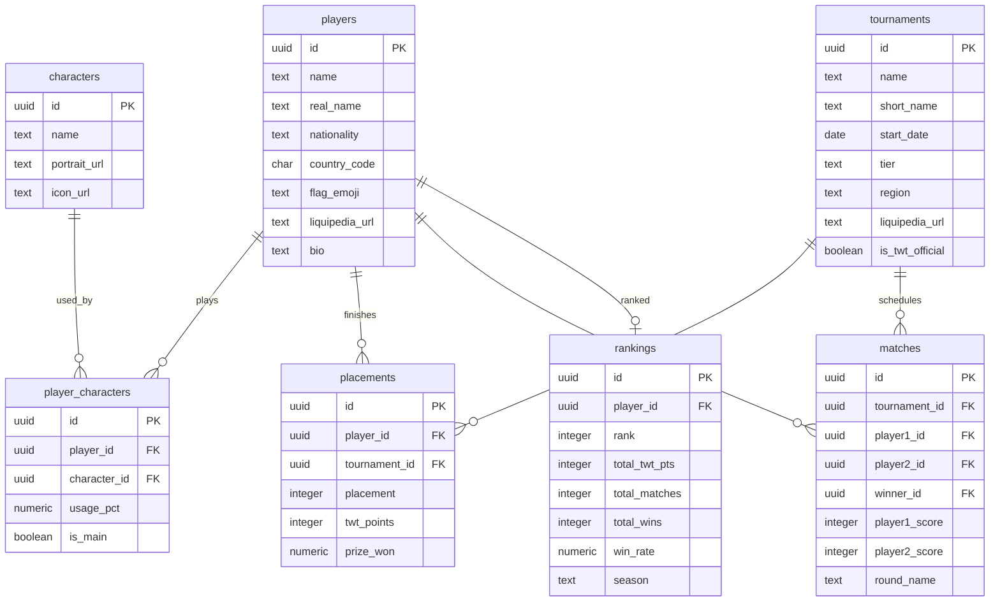

# 🥊 WallSplat.gg — Tekken 8 Leaderboard & Stats Tracker

**WallSplat.gg** is a premium web application for tracking the global competitive *Tekken 8* scene. Designed around the dark, intense menu aesthetics of *Tekken 8*, WallSplat provides fans and debaters with a Top 25 leaderboard, detailed career profiles for pro players, and side-by-side head-to-head (H2H) comparison analytics.

---

## 🚀 Key Features

* **Global & Regional Leaderboard:** The Top 25 competitive players sorted by official Tekken World Tour (TWT) points, with client-side filters for official TWT regions (**APAC, EMEA, NA, LATAM**).
* **Deep Player Profiles:** Detailed career summaries, overall match win rates, character usage percentage bars, recent tournament placements, and their last 10 match logs.
* **H2H Comparison Tool (with Visual Tornado Charts):** Side-by-side matchup comparisons with animated **bi-directional (tornado) bar charts** comparing points, ranks, win rates, matches, and wins.
* **On-Demand Liquipedia Scraper:** A Python scraper (BeautifulSoup + Playwright) that handles dynamic JavaScript rendering on Liquipedia tournament bracket pages, aggregates matches, and rebuilds the rankings cache.
* **Admin Dashboard:** A password-protected admin panel to trigger scraper runs, monitor execution status, and read real-time log outputs.

---

## 🛠️ Technology Stack

| Layer | Technology | Description |
|---|---|---|
| **Frontend** | **Next.js 14 (App Router)** | Pre-rendered pages (SSR) directly querying the database for instant, lightning-fast loads. |
| **Styling** | **Tailwind CSS** | Custom visual theme using Tekken 8’s menu colors (Red `#C8102E`, Gold `#FFD700`, Dark `#0A0A0A`). |
| **Database** | **PostgreSQL** | Relational data model running inside Docker for local development. |
| **Scraper** | **Python 3.13** | Scraper script using `psycopg2` and `BeautifulSoup4` with high-fidelity fallback mock data. |

---

## 📁 Database Schema Model



---

## ⚙️ Local Setup Instructions

### 1. Database Setup (Docker)
Start the PostgreSQL container locally using Docker:
```bash
docker run --name wallsplat-postgres -e POSTGRES_PASSWORD=wallsplat_secret -e POSTGRES_DB=wallsplat -p 5432:5432 -d postgres:latest
```

Ensure the database schema is initialized by running `schema.sql`:
```bash
# Run schema SQL (e.g., using psql or your preferred database tool)
psql -h localhost -U postgres -d wallsplat -f schema.sql
```

### 2. Python Environment & Seeding
Set up a Python virtual environment and install requirements:
```bash
# Create and activate virtual environment
python -m venv .venv
.venv\Scripts\activate

# Install dependencies
pip install -r requirements.txt
```

Seed initial characters, players list, and tournament registries:
```bash
python scripts/seed.py
```

### 3. Running the Scraper
Run the main scraper to populate the database with comprehensive tournament brackets, pool results, and player career rankings:
```bash
python scraper/scrape.py
```

*Note: The scraper will execute with a high-fidelity local fallback dataset containing results and placements for 17 major 2024 and 2025 tournaments.*

### 4. Running the Web Application
Configure environment variables in a `.env.local` file in the root folder:
```env
ADMIN_PASSWORD=your_secure_password
```

Install Next.js dependencies and start the development server:
```bash
# Install NPM packages
npm install

# Start Next.js development server
npm run dev
```

Open `http://localhost:3000` in your browser.

---

## 🧪 Verification & Linting
Run the production build tool to verify compiler type safety and ESLint constraints:
```bash
npm run build
```

---

*Made with 🥊 by Asad. WallSplat is not affiliated with Bandai Namco Entertainment.*
